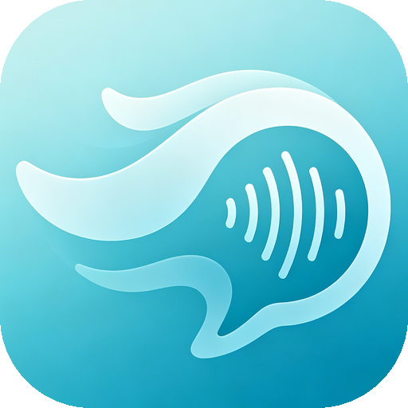
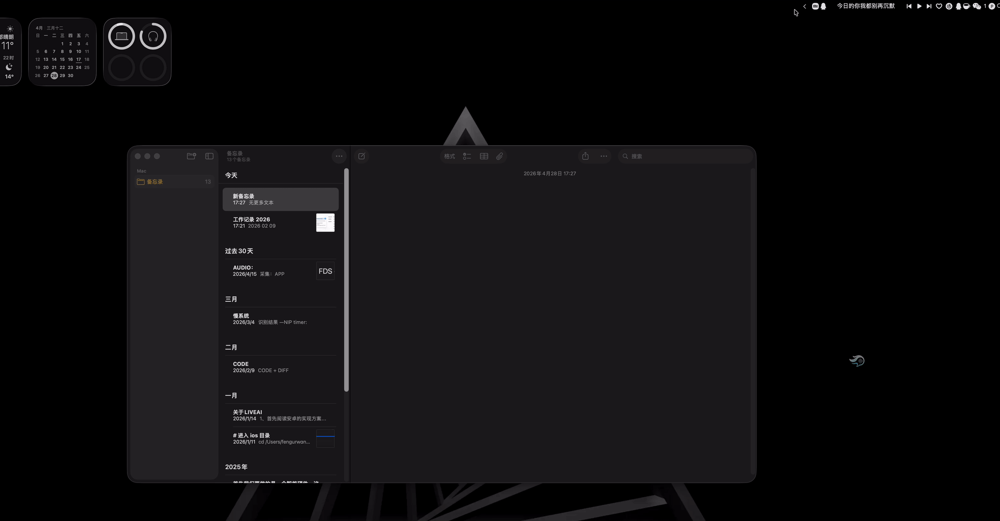

# WindWhisper
> English | [中文](README_CN.md)

<p align="center">
  
</p>

<p align="center">
  <b>Offline voice input assistant for macOS</b><br>
  Click the floating bubble, speak, text appears at the cursor — no internet required, fully on-device
</p>

<p align="center">
  
</p>

## Features

- 🎤 **Offline recognition** — Powered by SenseVoice, runs entirely on-device, no data leaves your machine
- 🌐 **Multi-language** — Chinese, English, Japanese, Korean, Cantonese with automatic language detection
- 🔤 **Auto-punctuation** — Recognition results include punctuation
- 📋 **Auto-paste** — Recognized text is automatically pasted at the cursor position (can be disabled)
- 🎯 **Floating bubble** — Always-on-screen bubble, click to record, draggable
- ⏱️ **Countdown timer** — Up to 60 seconds per recording with countdown animation
- 📝 **Result panel** — Result stays visible; supports copy and dismiss
- 🎨 **WindWhisper theme** — Celadon-toned UI with ripple animation

## Requirements

- macOS 13.0+
- Apple Silicon or Intel Mac
- ~400 MB disk space (including models)

## Installation

Download the latest release from [Releases](https://github.com/Fengur/WindWhisper/releases), unzip, and drag `WindWhisper.app` to Applications.

On first launch, grant permissions:
1. **Microphone** — the system will prompt automatically
2. **Accessibility** — required for auto-paste into input fields (optional)

## Usage

1. Launch — a floating bubble appears on the screen edge
2. **Click the bubble** to start recording (bubble expands, countdown appears)
3. **Click again** to stop recording and wait for recognition
4. Result appears in the panel and auto-pastes to the focused input field
5. Click the **copy button** to copy manually, or **×** to dismiss the panel

The status bar icon also supports left-click to start/stop recording and right-click for the menu.

## Settings

Open via status bar icon → right-click → **Settings…** (`⌘,`).

| Option | Description |
|--------|-------------|
| **Recognition Language** | `中文` / `English` / `Auto`. Auto covers zh/en/ja/ko/yue; pin to a language if detection misfires. |
| **Auto-paste** | Paste result via simulated `Cmd+V` to the focused input field. When off, text only goes to clipboard. |
| **Show Floating Bubble** | Hide the always-on bubble; the status bar icon still works. |
| **Reset Position** | Snap the bubble back to the default right-edge position. Use after multi-monitor changes or if the bubble drifts off screen. |

### Status Bar Right-Click Menu

- **Status**: live readout of `Ready` / `Recording` / `Recognizing`
- **Last**: preview of the most recent recognition result
- **Start / Stop Recording**: keyboard-centric workflow without touching the bubble
- **Show Bubble (Reset Position)**: fallback entry if the bubble disappears — forces reset to default position and makes it visible
- **Settings…** / **Quit WindWhisper** (`⌘Q`)

### Permissions

| Permission | Purpose | Required? |
|------------|---------|-----------|
| Microphone | Recording | Required |
| Accessibility | Auto-paste (simulate `Cmd+V`) | Only when auto-paste is enabled |

After granting Accessibility permission, **restart the app once** for it to take effect.

### Persistent Settings

All settings are stored in `~/Library/Preferences/com.windwhisper.app.plist` (managed by `UserDefaults`) and are preserved across reinstalls. The last bubble position is also stored here.

## Technical Details

### Architecture

```
Microphone (AVAudioEngine 16kHz) → PCM recording → SenseVoice offline recognition → text injection
```

### Core Tech Stack

| Component | Technology |
|-----------|-----------|
| Speech Recognition | [sherpa-onnx](https://github.com/k2-fsa/sherpa-onnx) + [SenseVoice](https://github.com/FunAudioLLM/SenseVoice) |
| Audio Capture | AVAudioEngine (16kHz mono Float32) |
| Mic Gain | [micvol](https://github.com/Fengur/micvol) (hardware-level input volume control) |
| UI Framework | AppKit + [SnapKit](https://github.com/SnapKit/SnapKit) |
| Animation | Core Animation |
| Text Injection | NSPasteboard + CGEvent / AppleScript |
| Fallback ASR | [whisper.cpp](https://github.com/ggerganov/whisper.cpp) (English) |

### Recognition Models

- **SenseVoice int8** (228 MB) — primary recognizer, supports zh/en/ja/ko/yue
- **Whisper small** (466 MB) — English fallback

### Post-processing

- Hallucination filter (common whisper subtitle watermarks etc.)
- Traditional → Simplified Chinese conversion (~130 common character mappings)

## Building from Source

### Prerequisites

- Xcode 15+
- [XcodeGen](https://github.com/yonaskolb/XcodeGen)
- CMake (for building sherpa-onnx)

### Steps

```bash
# 1. Clone the repo
git clone https://github.com/Fengur/WindWhisper.git
cd WindWhisper

# 2. Build sherpa-onnx
git clone --depth 1 https://github.com/k2-fsa/sherpa-onnx vendor/sherpa-onnx
cd vendor/sherpa-onnx && bash build-swift-macos.sh && cd ../..
cp -r vendor/sherpa-onnx/build-swift-macos/sherpa-onnx.xcframework Libraries/
cp vendor/sherpa-onnx/build-swift-macos/install/lib/libonnxruntime.a Libraries/

# 3. Download SenseVoice model
mkdir -p WindWhisper/Resources/sensevoice
curl -L -o WindWhisper/Resources/sensevoice/model.int8.onnx \
  https://huggingface.co/csukuangfj/sherpa-onnx-sense-voice-zh-en-ja-ko-yue-2024-07-17/resolve/main/model.int8.onnx
curl -L -o WindWhisper/Resources/sensevoice/tokens.txt \
  https://huggingface.co/csukuangfj/sherpa-onnx-sense-voice-zh-en-ja-ko-yue-2024-07-17/resolve/main/tokens.txt

# 4. (Optional) Download Whisper model
curl -L -o WindWhisper/Resources/ggml-small.bin \
  https://huggingface.co/ggerganov/whisper.cpp/resolve/main/ggml-small.bin

# 5. Generate Xcode project and build
xcodegen generate
xcodebuild -project WindWhisper.xcodeproj -scheme WindWhisper -configuration Release build
```

## Roadmap

### v1.0 (current)
- ✅ SenseVoice offline recognition
- ✅ Floating bubble + auto-paste
- ✅ Multi-language support

### v2.0 (planned)
- 🔲 Better streaming recognition
- 🔲 VAD auto-stop
- 🔲 Keyboard shortcut support
- 🔲 Bubble visual upgrade (WindWhisper theme animation)
- 🔲 Audio device hot-plug monitoring

## Feedback

- 🐛 **Bugs / feature requests**: [Issues](https://github.com/Fengur/WindWhisper/issues)
- 📮 **Email**: fengur@qq.com

Please include macOS version, device model, and reproduction steps. Logs live at `~/Library/Logs/WindWhisper/`.

## Credits

- Visual design: **Wu Xian (吴贤)** — app icon, floating bubble, status bar icon
- [sherpa-onnx](https://github.com/k2-fsa/sherpa-onnx) — offline speech recognition framework
- [SenseVoice](https://github.com/FunAudioLLM/SenseVoice) — multi-language speech recognition model
- [whisper.cpp](https://github.com/ggerganov/whisper.cpp) — C/C++ port of OpenAI Whisper
- [micvol](https://github.com/Fengur/micvol) — macOS microphone volume control

## License

MIT
